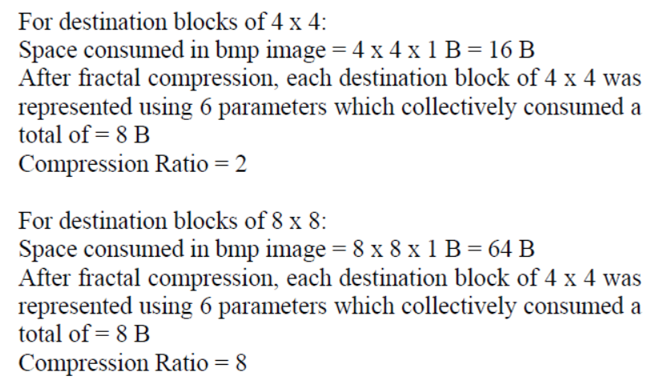
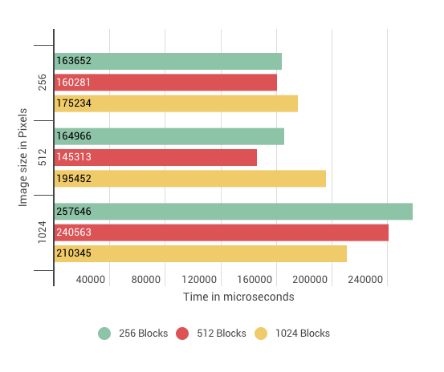
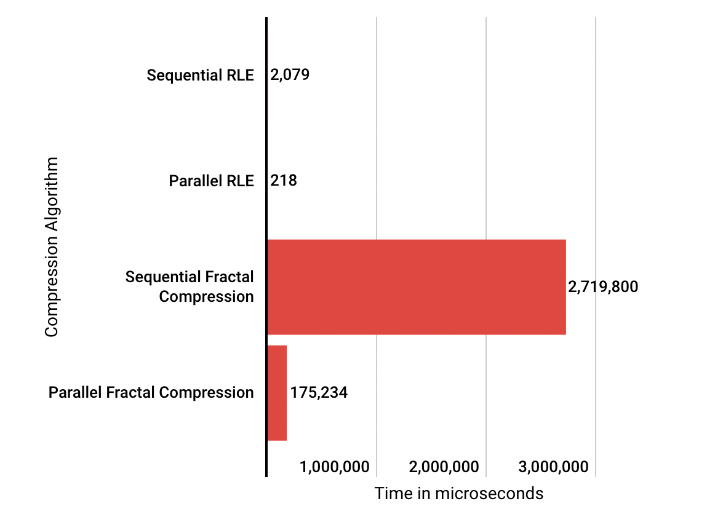

# Parallel Fractal Compression [[PDF]](Report.pdf)

## Abstract

A comparison of various parallelized approaches to optimize image compression time using Fractal Compression and Run Length Encoding Algorithm using CUDA and OpenMP. Our project focused on two image compression algorithms: fractal compression and run length encoding (RLE). These are lossy and lossless, respectively. These algorithms can be time consuming, especially for larger images. By introducing parallelism through multi-core GPUs, we were able to demonstrate significant reduction in their runtimes. Since our university course focused extensively on multiple techniques for parallelizing algorithms involving integer matrices, we found its implementation in image compression. This was accomplished by recognizing which steps in the algorithms have scope for parallelization. Following their implementation, an analysis was conducted by comparing the compression times between different algorithm implementations in both their sequential and parallel forms.

## Compression Estimation  

 

 
 
Compression ratio calculation for Fractal Image Compression

 

## Results

 

 
Experimental results with different block sizes for Parallel Fractal Compression

 

 

 
Overall comparative results between Fractal Compression and Run Length Encoding

 